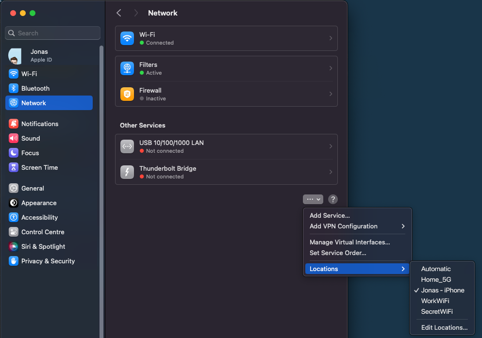

# OSX WiFi Location Switcher

Automatically manage your macOS network configurations based on your current WiFi connection using [network location](https://support.apple.com/en-us/105129). This tool is perfect for people who need different network settings (like DNS servers or proxy settings) when connecting to different networks, such as switching between home and office environments.

## Key Benefits

- Smart Detection: Your Mac automatically detects which WiFi network you're using and switches to the appropriate network configuration
- Multiple Network Alias Support: Map several WiFi networks to the same configuration profile
- Custom Automation: Run specific scripts whenever you connect to particular networks

## Getting Started

To install the tool:

```bash
# Download the project files
git clone https://github.com/Failbait/osx-wifi-locations.git

# Navigate to the project folder
cd ./osx-wifi-locations

# Launch the installation script
./install.sh
```

Note: The installation process requires sudo privileges to place files in `/usr/local/bin`.

## Basic Setup

The tool follows a simple naming convention: create network locations that match your WiFi network names. For instance:

If your home WiFi is named `HomeNetwork_5G`, create a network location called `HomeNetwork_5G`. The switcher will automatically switch to this location when you connect to your home network. For any WiFi networks without a matching location name, the system defaults to the `Automatic` location.

You can find the locations tab in Settings -> Network -> Three ... in the lower right:


## Advanced Configuration

### Network Alias Mapping

To use the same network location for multiple WiFi networks, create a mapping file at `~/.osx-wifi-locations/alias.conf`. Example:

```text
Office_5GHz=WorkSettings
Office_2.4GHz=WorkSettings
Conference_Room=WorkSettings
```

### Automated Scripts

The tool can execute custom scripts when connecting to specific networks:

1. Create your scripts in the `~/.osx-wifi-locations/` directory
2. Name each script to match its corresponding WiFi network
3. Make the scripts executable with `chmod +x`

Example security script for home network (`~/.osx-wifi-locations/HomeNetwork_5G`):

```bash
#!/usr/bin/env bash
exec 2>&1

# Enable enhanced security features
/usr/libexec/ApplicationFirewall/socketfilterfw --setglobalstate on
```

To reverse changes when switching networks, create a reset script (`~/.osx-wifi-locations/Automatic`):

```bash
#!/usr/bin/env bash
exec 2>&1

# Return to standard security settings
/usr/libexec/ApplicationFirewall/socketfilterfw --setglobalstate off
```

Remember to make the scripts executable with `chmod +x`:

```bash
chmod +x ~/.osx-wifi-locations/My_Home_Wi-Fi_5GHz
chmod +x ~/.osx-wifi-locations/Automatic
```

## Debugging

Monitor the tool's activity by viewing the log file:

```bash
tail -f ~/Library/Logs/osxwifilocations.log
```

Sample log output:

```text
[2023-11-26 13:44:49] current wifi_name 'HomeNetwork_5G'
[2023-11-26 13:44:49] network locations: Automatic WorkSettings
[2023-11-26 13:44:49] found matching location 'WorkSettings'
[2023-11-26 13:44:49] executing network script '/Users/username/.osx-wifi-locations/WorkSettings'
```

## Support and Development

We welcome community contributions! If you have ideas for improvements or find any issues, please:

- Open an issue on GitHub
- Submit a pull request with your proposed changes

## Licensing

Available under the MIT License. See the [LICENSE](LICENSE) file for details.
